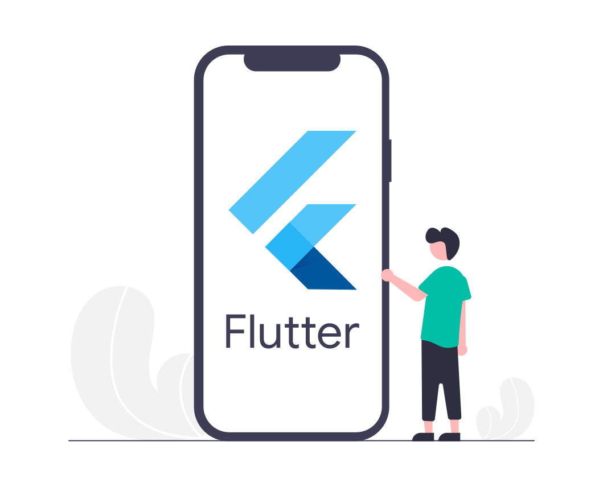

### Hello Devs :nerd_face: :rocket: :blue_heart: :notebook:

```sh
echo "Hello Devs! The image down here is created by me :-)"
echo "It means Rebecchi Mari Matteo (RMM)"
```

<p align="center">


</p>

### Contacts

<p align="left">
<a href="mailto:matteo.rebecchimari@gmail.com">

</a>

<a href="https://twitter.com/FlutterMatteR">

</a>

<a href="https://it.linkedin.com/in/matteo-rebecchi-mari-18349812b">

</a>

<a href="https://github.com/MatteoRebecchiMari">

</a>
</p>

### What I am 

I'd say “something” next to a classical engineer :nerd_face: :rocket: :blue_heart: :notebook:.

### What I like

- coding :computer:, techs :calling: & Operating Systems  :penguin: :apple: 
- cats :cat:
- snowboard :snowboarder:
- mathematics :notebook:
- motorbikes :motorcycle:

### More about me... :footprints:

<p align="center">
<a href="https://developer.android.com/">

</a>
</p>

My passion for smartphones let me land into the [Android] development world, from which were born both my degree-thesis projects (three-year and masters).

<p align="center">

</p>

I believe that teamwork is fondamental.

<p align="center">
<a href="https://www.java.com/en/">

</a>

<a href="https://docs.microsoft.com/en-US/dotnet/">

</a>

<a href="https://unity.com/">

</a>

<a href="https://dotnet.microsoft.com/apps/xamarin">

</a>

</p>

From a [Java] background, in the last few years I started to work with the [.NET] framework, finding a sweet affinity for [Unity] e [Xamarin].

<p align="center">
<a href="https://flutter.dev/">

</a>
</p>

Recently I got passionate about the mobile framework [Flutter] from which I made some small projects.

<p align="center">
<a href="https://www.flutnet.com">

</a>
</p>

At last, but not least, I have worked on the birth of [Flutnet].


<!--  Link Defintions -->
[Flutnet]: www.flutnet.com
[Flutter]: https://flutter.dev/
[.NET]: https://docs.microsoft.com/en-US/dotnet/
[Xamarin]: https://dotnet.microsoft.com/apps/xamarin
[Unity]: https://unity.com/
[Java]: https://www.java.com/en/
[Android]: https://developer.android.com/


<!--
**MatteoRebecchiMari/MatteoRebecchiMari** is a ✨ _special_ ✨ repository because its `README.md` (this file) appears on your GitHub profile.

Here are some ideas to get you started:

- 🔭 I’m currently working on ...
- 🌱 I’m currently learning ...
- 👯 I’m looking to collaborate on ...
- 🤔 I’m looking for help with ...
- 💬 Ask me about ...
- 📫 How to reach me: ...
- 😄 Pronouns: ...
- ⚡ Fun fact: ...
-->
